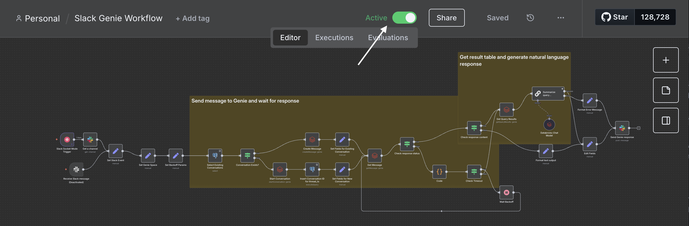

# Databricks Genie Slack Integration Solution Accelerator

## Overview

This accelerator enables your business to interact with Databricks datasets conversationally from Slack, powered by Genie and orchestrated through n8n. By deploying this solution, your teams can ask data questions in Slack and receive instant, actionable insights—accelerating decision-making and enabling data-driven collaboration across the organization.

---

## Table of Contents

- [Dependencies](#dependencies)
- [Prerequisites](#prerequisites)
- [Installation Steps](#installation-steps)
  - [1. Set Up Managed Postgres (Lakebase)](#1-set-up-managed-postgres-lakebase)
  - [2. Install AI/BI Marketing Campaign Demo via dbdemos](#2-install-aibi-marketing-campaign-demo-via-dbdemos)
  - [3. Set Up ngrok Account](#3-set-up-ngrok-account)
  - [4. Create Slack App](#4-create-slack-app)
  - [5. Create Databricks Secrets and Deploy Databricks App](#5-create-databricks-secrets-and-deploy-databricks-app)
  - [6. Configure n8n Instance](#6-configure-n8n-instance)
- [Usage](#usage)
- [Troubleshooting](#troubleshooting)
- [Credits](#credits)

---

## Dependencies

- **Postgres (Lakebase):** Stores mapping between Slack threads and Genie conversation IDs.
- **dbdemos:** Required for installing the `aibi-marketing-campaign` demo asset.
- **ngrok:** Exposes n8n webhook endpoints to Slack for event delivery.
- **Slack App:** Custom bot for receiving and responding to user queries in Slack.
- **Databricks Asset Bundles:** Used to deploy App resource in the Databricks Workspace.
- **Databricks Community Nodes Package:** Required for workflow execution.
- **n8n:** Self-hosted version that orchestrates communication between Slack, Genie API, and Databricks.

---

## Prerequisites

- Databricks workspace with Asset Bundle support.
- Managed Postgres (Lakebase) instance.
- Necessary permissions to create Databricks App and Genie resources.
- Slack workspace with permissions to create a custom app.
- ngrok account for webhook tunneling.
- Databricks Access Token with appropriate permissions to use Genie API and Foundation Models API.

---

## Installation Steps

### 1. Set Up Managed Postgres (Lakebase)

- Provision a managed Postgres instance (Lakebase).
- Create a table to map Slack thread IDs to Genie conversation IDs:

```sql
CREATE TABLE slack_thread_conversations (
thread_ts VARCHAR,
genie_conversation_id VARCHAR,
slack_channel VARCHAR
slack_channel_resolved VARCHAR,
PRIMARY KEY (thread_ts, slack_channel)
);
```

- Create a Postgres native user and password for n8n:

```sql
CREATE USER pguser WITH PASSWORD 'password123';
```

---

### 2. Install AI/BI Marketing Campaign Demo via dbdemos

- In your Databricks workspace, install the demo asset using dbdemos by opening a notebook and executing:

```python
%pip install dbdemos
import dbdemos
spark.sql("CREATE CATALOG IF NOT EXISTS <insert_catalog_name>")
dbdemos.install('aibi-marketing-campaign', catalog = "<insert_catalog_name>")
```


---

### 3. Set Up ngrok Account

- Sign up for an ngrok account and create a new domain.


---

### 4. Create Slack App

- Refer to [n8n documentation](https://docs.n8n.io/integrations/builtin/credentials/slack/) for Slack credential setup.

**Summary:**
- Go to [Slack API: Your Apps](https://api.slack.com/apps) and create a new app.

- Add Bot Token Scopes: `app_mentions:read`, `chat:write`, `channels:history`.

- Enable Events and set the Request URL to your n8n webhook URL. 
    - Use the Production webhook URL when you want to 'Activate' the workflow to consistently listen for Slack events. Otherwise, use the Test webhook URL for ad hoc execution of the workflow in 'Inactive' mode.

- Subscribe the app to bot events (`app_mention`).


- Add the app to your workspace.


---

### 5. Create Databricks Secrets and Deploy Databricks App

#### **A. Create Databricks Secrets Using the Databricks CLI**

You will need to create the following secrets in a designated scope:

| Name               | Scope         | Key               | Permission |
|--------------------|--------------|-------------------|------------|
| ngrok-token        | `<name-of-scope>` | ngrok-token       | READ       |
| ngrok-url          | `<name-of-scope>` | ngrok-url         | READ       |
| postgres-password  | `<name-of-scope>` | postgres-password | READ       |
| postgres-user      | `<name-of-scope>` | postgres-user     | READ       |
| postgres-host      | `<name-of-scope>` | postgres-host     | READ       |

**Step 1: Create the secret scope (if not already created):**

```bash
databricks secrets create-scope --scope <name-of-scope>
```

**Step 2: Add each secret:**

```bash
databricks secrets put --scope <name-of-scope> --key ngrok-token --string-value "<your-ngrok-token>"
databricks secrets put --scope <name-of-scope> --key ngrok-url --string-value "<your-ngrok-url>"
databricks secrets put --scope <name-of-scope> --key postgres-password --string-value "<your-postgres-password>"
databricks secrets put --scope <name-of-scope> --key postgres-user --string-value "<your-postgres-user>"
databricks secrets put --scope <name-of-scope> --key postgres-host --string-value "<your-postgres-host>"
```


**Step 3: Set permissions (optional, if you need to specify READ access for a group or user):**

```bash
databricks secrets put-acl --scope trevorosborne --principal users --permission READ
```

For more details, see the [Databricks documentation on secret management](https://docs.databricks.com/aws/en/security/secrets/).

---

#### **B. Deploy Databricks App via Asset Bundle**

- Clone this repository and edit the `databricks.yml` file by replacing <your-databricks-workspace-host> with your Databricks workspace host and <your-scope-name> with the scope that was created to store the Databricks secrets.

- Deploy the bundle:
```bash
databricks bundle validate
databricks bundle deploy
databricks bundle run n8n-databricks-app
```

- Use `databricks bundle summary` to retrieve the app resource URL and verify deployment.

---

### 6. Configure n8n Instance

- Access your n8n instance via the URL provided by your Databricks App deployment.

- Install the Databricks Community Node: 

Go to Settings → Community Nodes → Enter `n8n-nodes-databricks`.


- Import the provided Workflow JSON (`slack_genie_integration_workflow.json`).


- Add and configure credentials for:
    - Slack (OAuth token)
    - Postgres (use connection details from Databricks Workspace - Compute UI and the credentials created earlier)
    - Databricks (Access Token)
    - **NOTE:** You will need to open each node with a red warning icon and select the corresponding credentials from the dropdown at the top of the form.


- Replace the space_id in the `Set Genie Space` node with your Genie space's Space ID (found in the Genie Space URL).


- Set the specified channel(s) in 'Channel to Watch' dropdown for the `Receive Slack Message` node;


- Activate the workflow.



---

## Usage

- In your designated Slack channel, tag the Slack App bot and ask a question about your dataset.
- The bot will process your request, query Genie via Databricks, and respond in the thread.
- Conversations are created for each individual thread. To continue a conversation with full context, reply within the same thread.


---

## Troubleshooting

- **Workflow Import Issues:** Ensure the n8n workflow JSON is valid and all credentials are configured.
- **Slack Events Not Received:** Verify ngrok tunnel is active and Slack event URLs are correct.
- **Database Errors:** Confirm Lakebase connection details and table schema match the workflow configuration.
- **Databricks API Errors:** Check that the access token is valid and has necessary permissions.
- **Other Issues:** Contact trevor.osborne@databricks.com for help.

---

## Credits

- Mike Lo (Solutions Architect @ Databricks): Created the original template for the n8n Databricks app and maintains the n8n-nodes-databricks npm package.
- Trevor Osborne (Sr. Solutions Engineer @ Databricks): Streamlined the integration with Slack.

---

