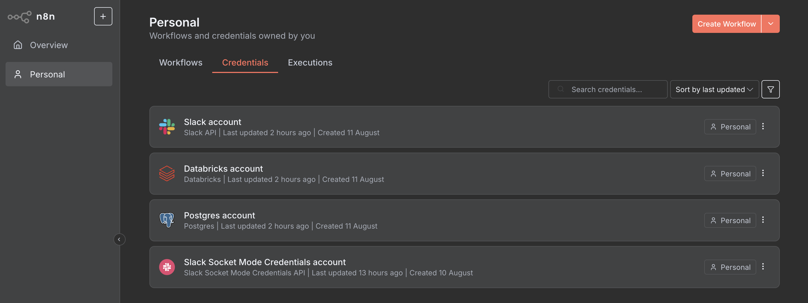

# Databricks Genie Slack Integration Solution Accelerator

## Overview

This accelerator enables your business to interact with Databricks datasets conversationally from Slack, powered by Genie and orchestrated through n8n. By deploying this solution, your teams can ask data questions in Slack and receive instant, actionable insights—accelerating decision-making and enabling data-driven collaboration across the organization.

---

## Table of Contents

- [Dependencies](#dependencies)
- [Prerequisites](#prerequisites)
- [Installation Steps](#installation-steps)
  - [1. Set Up Postgres Database](#1-set-up-postgres-database)
  - [2. Install AI/BI Marketing Campaign Demo via dbdemos](#2-install-aibi-marketing-campaign-demo-via-dbdemos)
  - [3. Set Up ngrok Account (Optional)](#3-set-up-ngrok-account)
  - [4. Create Slack App](#4-create-slack-app)
  - [5. Create Databricks Secrets and Deploy Databricks App](#5-create-databricks-secrets-and-deploy-databricks-app)
  - [6. Configure n8n Instance](#6-configure-n8n-instance)
- [Usage](#usage)
- [Troubleshooting](#troubleshooting)
- [Credits](#credits)

---

## Dependencies

- **Postgres:** 
    - Stores mapping between Slack threads and Genie conversation IDs 
    - Database used by n8n instance for persisting user data
    - Can use Databricks Lakebase (managed Postgres) or any external Postgres instance
    - **Important:** If using an external Postgres instance, ensure proper firewall rules are configured to allow connections from the Databricks App
- **dbdemos:** Required for installing the `aibi-marketing-campaign` demo asset.
- **ngrok (Optional):** Exposes n8n webhook endpoints to Slack for event delivery.
- **Slack App:** Custom bot for receiving and responding to user queries in Slack.
- **Databricks Asset Bundles:** Used to deploy App resource in the Databricks Workspace.
- **Databricks Community Nodes Package:** Required for workflow execution.
- **Slack Socket Mode Community Nodes Package:** Required for receiving Slack events via websocket instead of HTTP.
- **n8n:** Self-hosted version that orchestrates communication between Slack, Genie API, and Databricks.

---

## Prerequisites

- Databricks workspace with Asset Bundle support.
- Postgres instance:
  - **Option 1 (Recommended):** Databricks Lakebase (managed Postgres) for convenience
  - **Option 2:** Any external Postgres instance with network access configured to allow connections from Databricks App
- Necessary permissions to create Databricks App and Genie resources.
- Slack workspace with permissions to create a custom app.
- ngrok account for webhook tunneling (Optional - Not required if using Slack Socket Mode node).
- Databricks Access Token with appropriate permissions to use Genie API and Foundation Models API.

---

## Installation Steps

### 1. Set Up Postgres Database

You have two options for your Postgres database:

#### **Option 1: Databricks Lakebase (Recommended)**

Provision a managed Postgres instance through Databricks Lakebase for seamless integration.

#### **Option 2: External Postgres Instance**

If using an external Postgres instance:
- Ensure your Postgres server is accessible from the Databricks workspace
- Configure firewall rules to allow inbound connections from the Databricks App IP addresses
- Verify network connectivity and port access (default Postgres port: 5432)

#### **Database Setup (Both Options)**

Create the required schema and table to map Slack thread IDs to Genie conversation IDs:

```sql
CREATE SCHEMA genie_conversations;

CREATE TABLE genie_conversations.slack_genie_conversations (
thread_ts VARCHAR,
genie_conversation_id VARCHAR,
slack_channel VARCHAR,
slack_channel_resolved VARCHAR,
PRIMARY KEY (thread_ts, slack_channel)
);
```

Create a Postgres native user and password for n8n:

```sql
CREATE USER pguser WITH PASSWORD 'password123';
GRANT ALL PRIVILEGES ON SCHEMA genie_conversations TO pguser;
GRANT ALL PRIVILEGES ON ALL TABLES IN SCHEMA genie_conversations TO pguser;
```

---

### 2. Install AI/BI Marketing Campaign Demo via dbdemos

- In your Databricks workspace, install the demo asset using dbdemos by opening a notebook and executing:

```python
%pip install dbdemos
import dbdemos
spark.sql("CREATE CATALOG IF NOT EXISTS <insert_catalog_name>")
dbdemos.install('aibi-marketing-campaign', catalog = "<insert_catalog_name>")
```


---

### 3. Set Up ngrok Account (Optional)

- **NOTE:** This step is optional if you are using a workflow that receives Slack events via the default Slack n8n node (HTTP/webhook). Socket Mode is preferred if your organization has strict requirements and you need to be able to receive Slack events behind a corporate firewall without exposing a webhook via public internet.

- Sign up for an ngrok account and create a new domain.


---

### 4. Create Slack App

- Refer to [n8n documentation](https://docs.n8n.io/integrations/builtin/credentials/slack/) for Slack credential setup.

**Step-by-step setup:**

1. Go to [Slack API: Your Apps](https://api.slack.com/apps) and create a new app.

2. **Add Bot Token Scopes** - Navigate to "OAuth & Permissions" and add the following scopes:
   - `app_mentions:read` - View messages that directly mention the bot
   - `channels:read` - View basic information about public channels
   - `chat:write` - Send messages as the bot
   - `files:write` - Upload, edit, and delete files
   - `groups:read` - View basic information about private channels the bot is in
   - `users:read` - View people in the workspace


3. **[Enable Socket Mode](https://api.slack.com/apis/socket-mode)** - Navigate to "Socket Mode" in your app settings and enable it, then generate an App Level Token.


4. **Enable Events** (Optional - only if using webhook mode instead of Socket Mode):
   - Set the Request URL to your n8n webhook URL
   - Subscribe the app to bot events (`app_mention`)

    

   - Use the Production webhook URL when you want to 'Activate' the workflow to consistently listen for Slack events. Otherwise, use the Test webhook URL for ad hoc execution of the workflow in 'Inactive' mode.

    

5. **Install the app to your workspace** - Navigate to "Install App" and add the app to your Slack workspace.


---

### 5. Create Databricks Secrets and Deploy Databricks App

#### **A. Create Databricks Secrets Using the Databricks CLI**

You will need to create the following secrets in a designated scope:

| Name               | Scope         | Key               | Permission |
|--------------------|--------------|-------------------|------------|
| ngrok-token (Optional) | `<name-of-scope>` | ngrok-token       | READ   |
| ngrok-url (Optional) | `<name-of-scope>` | ngrok-url         | READ     |
| postgres-password  | `<name-of-scope>` | postgres-password | READ       |
| postgres-user      | `<name-of-scope>` | postgres-user     | READ       |
| postgres-host      | `<name-of-scope>` | postgres-host     | READ       |
| n8n-encryption-key    | `<name-of-scope>` | n8n-encryption-key  | READ  |

**Step 1: Create the secret scope (if not already created):**

```bash
databricks secrets create-scope --scope <name-of-scope>
```

**Step 2: Add each secret:**

```bash
databricks secrets put --scope <name-of-scope> --key ngrok-token --string-value "<your-ngrok-token>" #Optional: Only needed if receiving Slack events via webhook
databricks secrets put --scope <name-of-scope> --key ngrok-url --string-value "<your-ngrok-url>" #Optional: Only needed if receiving Slack events via webhook
databricks secrets put --scope <name-of-scope> --key postgres-password --string-value "<your-postgres-password>"
databricks secrets put --scope <name-of-scope> --key postgres-user --string-value "<your-postgres-user>"
databricks secrets put --scope <name-of-scope> --key postgres-host --string-value "<your-postgres-host>"
databricks secrets put --scope <name-of-scope> --key n8n-encryption-key --string-value "<random-32-byte-base64-encoded-string>" #This encryption key is used for encrypting credentials thare are stored in Postgres DB after created in n8n app via GUI. One method for generating this secure key is using OpenSSL command in Linux
```


**Step 3: Set permissions (optional, if you need to specify READ access for a group or user):**

```bash
databricks secrets put-acl --scope <name-of-scope> --principal users --permission READ
```

For more details, see the [Databricks documentation on secret management](https://docs.databricks.com/aws/en/security/secrets/).

---

#### **B. Deploy Databricks App via Asset Bundle**

- Clone this repository and edit the `databricks.yml` file by replacing <your-databricks-workspace-host> with your Databricks workspace host and <your-scope-name> with the scope that was created to store the Databricks secrets.

- Deploy the bundle:
```bash
databricks bundle validate
databricks bundle deploy
databricks bundle run n8n_databricks_app
```

- Use `databricks bundle summary` to retrieve the app resource URL and verify deployment.

---

### 6. Configure n8n Instance

- Access your n8n instance via the URL provided by your Databricks App deployment.

- Install Community Nodes: 

    - **NOTE:** The scripts included in package.json should automatically install the community nodes within the directory that n8n expects (~/.n8n/nodes) but if you do not see those nodes available then proceed with the installation via the GUI.

    - Go to Settings → Community Nodes → Enter `n8n-nodes-databricks`.

    

    - Repeat installation steps for `@mbakgun/n8n-nodes-slack-socket-mode`

#### **Import Workflows**

Import both the main workflow and error workflow JSON files:

1. **Main Workflow:** Import `slack_genie_integration_workflow.json`


2. **Error Workflow:** Import `Slack Genie Error Workflow.json`

The error workflow automatically handles failures from the main workflow and notifies users in Slack.

#### **Configure Credentials**

Add and configure credentials for:
- **Slack API** (OAuth token) - Required for sending messages
- **Slack Socket Mode** (Bot OAuth Token, App-Level Token, Signing Secret)
  - Find App-Level Token + Signing Secret at: https://api.slack.com/apps/`<your-app-id>`/general
- **Postgres** - Use connection details and credentials created in Step 1
- **Databricks** (Access Token) - For Genie API and Foundation Models access
- **n8n API** (API Key) - **Required for error workflow**
  - Go to Settings → n8n API in your n8n instance
  
  
  
  - Generate a new API key
  - Configure the credential with:
    - **API Key:** The generated key from above
    - **Base URL:** `http://localhost:8000/api/v1` (since we're self-hosting n8n with port 8000)
  
  
  
  - Add this credential in the error workflow's "Get execution data" node

**NOTE:** Only for the initial import, you will need to open each node with a red warning icon and select the corresponding credentials from the dropdown at the top of the form.



#### **Configure Genie Space**

After importing the workflows, you'll need to configure the following settings in the main workflow:

**In the "Set Genie Space" node:**
- Replace `space_id` value with your Genie Space ID (found in the Genie Space URL)
- Update `databricks_host` value to match your Databricks workspace URL (e.g., `https://your-workspace.cloud.databricks.com`)

**In the "Slack Socket Mode Trigger" node:**
- Update the `channelsToWatch` value with your Slack channel ID
- The channel ID can be found by right-clicking on the channel in Slack and selecting "Copy link" - it's the alphanumeric string at the end of the URL (e.g., `C094KAMLXJS`)

**Optional: If using the Slack Webhook node instead of Socket Mode:**
- The workflow includes a disabled "Receive Slack message" webhook node as an alternative to Socket Mode
- If you prefer to use webhooks, you'll need to:
  1. Disable the "Slack Socket Mode Trigger" node
  2. Enable the "Receive Slack message" webhook node
  3. Configure the webhook URL in your Slack app settings:
     - **For published workflows:** Use the Production webhook URL to consistently listen for Slack events
     - **For local testing:** Use the Test webhook URL for ad hoc execution within the n8n app


#### **Publish Workflows**

- Publish the **error workflow first** (Slack Genie Error Workflow)
- Then publish the **main workflow** (Slack Genie Workflow)


---

## Usage

- In your designated Slack channel, tag the Slack App bot and ask a question about your dataset.
- The bot will send your message to the Genie space, where Genie generates and executes a SQL query via a Databricks SQL Warehouse.
- Final results are summarized by a Databricks Foundation Model and posted in the Slack thread.
- For query results, you'll receive:
  - An AI-generated natural language summary
  - A CSV file attachment with the raw data
  - A link to view the conversation in the Genie Space
- Conversations are created for each individual thread. To continue a conversation with full context, reply within the same thread.
- If any errors occur during execution, the error workflow will automatically notify you in the same Slack thread.


---

## Troubleshooting

- **Workflow Import Issues:** Ensure the n8n workflow JSON is valid and all credentials are configured.
- **Slack Events Not Received:** 
  - If using webhooks: Verify ngrok tunnel is active and Slack event URLs are correct
  - If using Socket Mode: Verify App-Level Token is correct and Socket Mode is enabled in Slack app settings
- **Database Connection Errors:** 
  - Confirm Postgres connection details and table schema match the workflow configuration
  - If using external Postgres: Verify firewall rules allow connections from Databricks App
  - Test connectivity using a Postgres client tool
- **Databricks API Errors:** Check that the access token is valid and has necessary permissions (Genie API, Foundation Models API).
- **Error Workflow Not Triggering:** 
  - Ensure the error workflow is activated before the main workflow
  - Verify n8n API credentials are configured correctly with Base URL: `http://localhost:8000/api/v1`
  - Check that the error workflow ID matches the `errorWorkflow` setting in the main workflow
- **n8n API Authentication Issues:** 
  - Generate a new API key in Settings → n8n API
  - Ensure Base URL is set to `http://localhost:8000/api/v1` (matches the N8N_PORT environment variable)
  - Update the n8n API credential in the error workflow
- **Other Issues:** Contact trevor.osborne@databricks.com for help.

---

## Disclaimer

This solution accelerator is provided for use in development environments only. It is intended as a reference implementation and should be thoroughly tested and validated by your team before being used in any production setting. Databricks makes no warranties, express or implied, regarding the suitability, reliability, or accuracy of this accelerator for production use. Implementation and deployment into a production environment are the sole responsibility of the customer.

---

## Credits

- Mike Lo (Solutions Architect @ Databricks): Created the original template for the n8n Databricks app and maintains the n8n-nodes-databricks npm package.
- Trevor Osborne (Sr. Solutions Engineer @ Databricks): Streamlined the integration with Slack.

---

